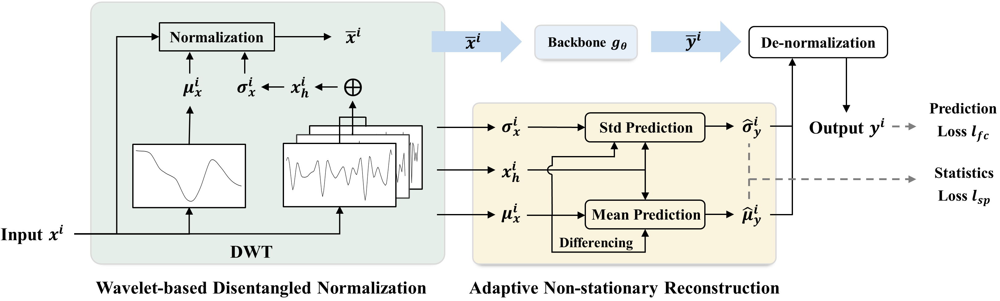
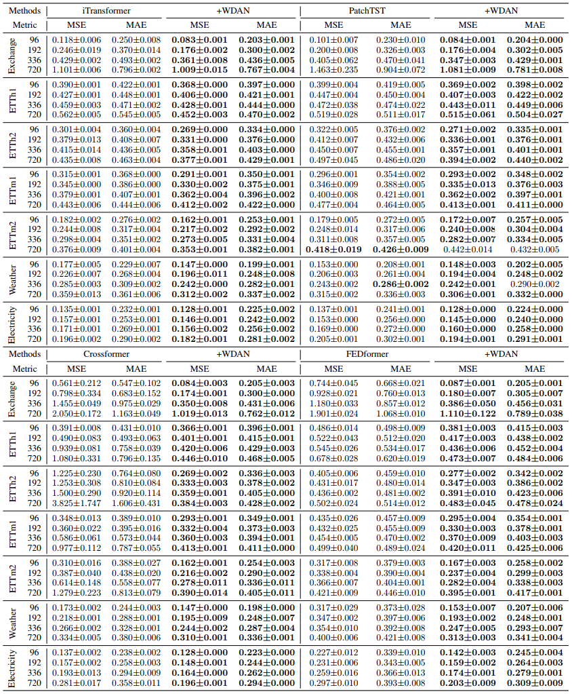

# WDAN
This repo is the official implementation for the paper: Wavelet-based Disentangled Adaptive Normalization for Non-stationary Times Series Forecasting

## Model Framework

<p align="center">

<br><br>
<b>Figure 1.</b> Overall structure of WDAN.
</p>

## Main Results



## Get Started
1. Install Pytorch and necessary dependencies.
```
pip install -r requirements.txt
```

2. Prepare Data. You can obtain the datasets from https://github.com/thuml/Time-Series-Library. Place the downloaded data in the folder `./dataset`. The default data path configurations are recorded in `./utils/config_utils.py`.

2. Train and evaluate the model (`WDAN_backbone`)
```
# Simple run
python run.py --model WDAN_iTransformer --dataset ETTh1

# Scripts for WDAN_iTransformer
bash ./scripts/WDAN_iTransformer.sh
```

## Acknowledgement

We appreciate the following github repos a lot for their valuable code base or datasets:

https://github.com/thuml/Time-Series-Library

https://github.com/thuml/iTransformer

https://github.com/Thinklab-SJTU/Crossformer

https://github.com/MAZiqing/FEDformer

https://github.com/zhouhaoyi/Informer2020


